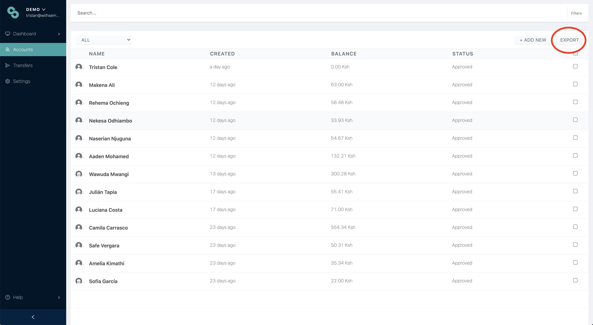
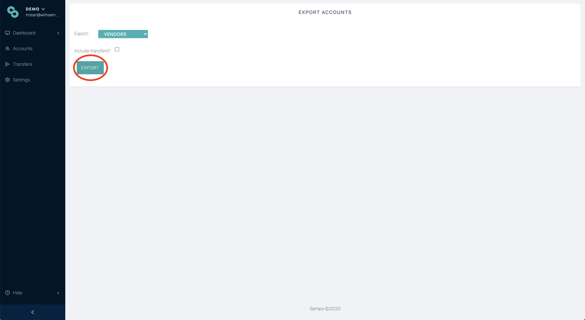

# Exporting data to excel

1. Go to the accounts page

2. Click "Export" button

3. Choose if you'd like to export Beneficiaries, Vendors, All or **Selected** \(accounts you **selected** on previous page\)

4. Choose if you'd like to export Transfers of those accounts

5. Click "Export" button

