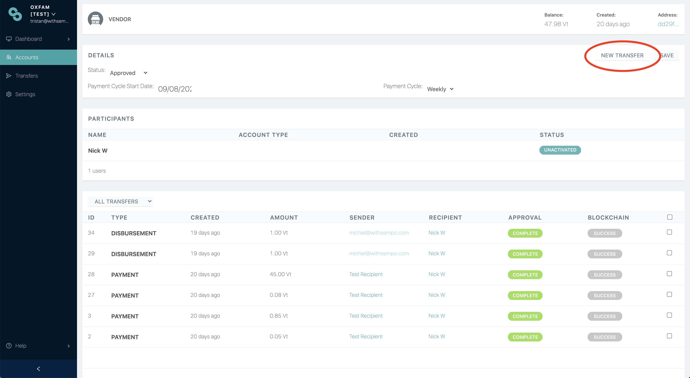
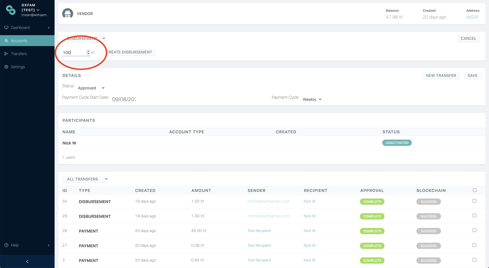
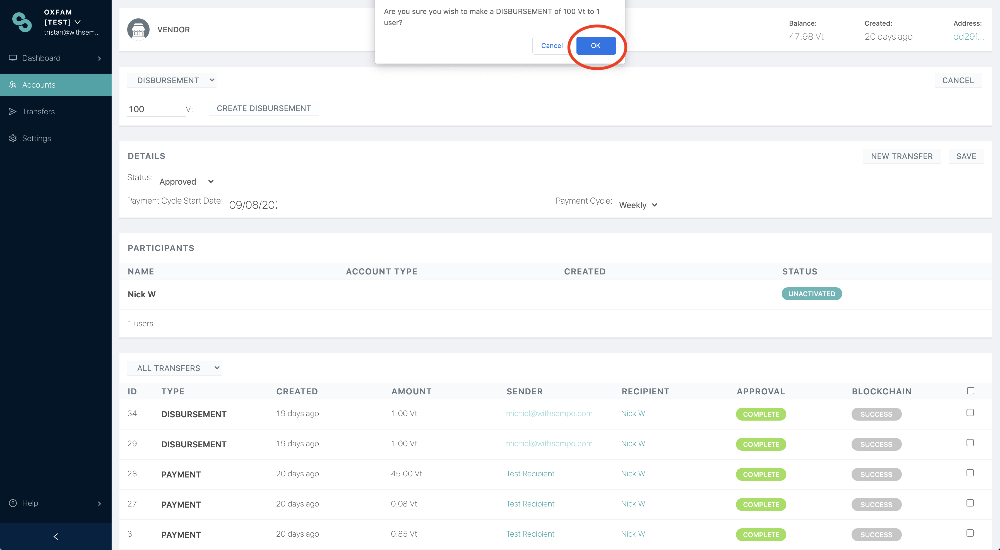
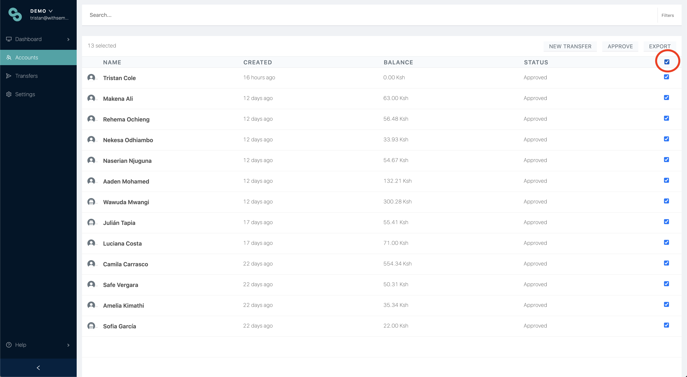
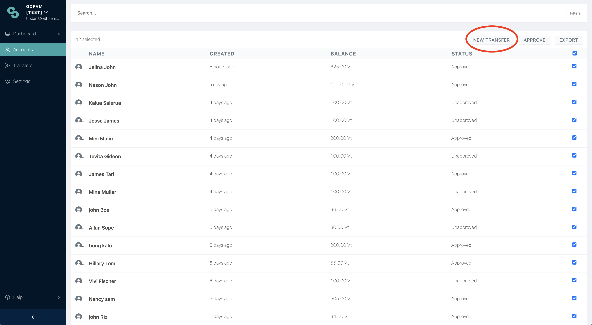
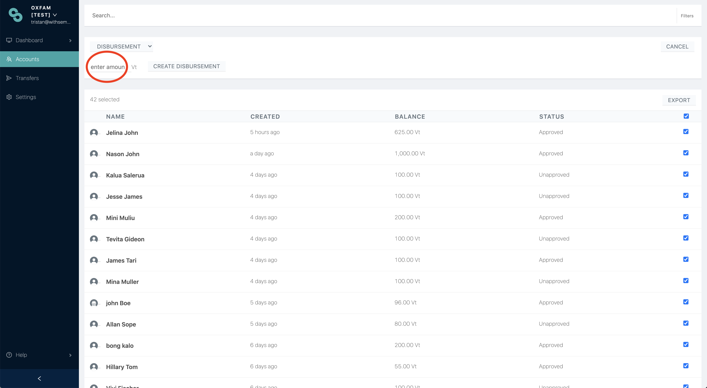
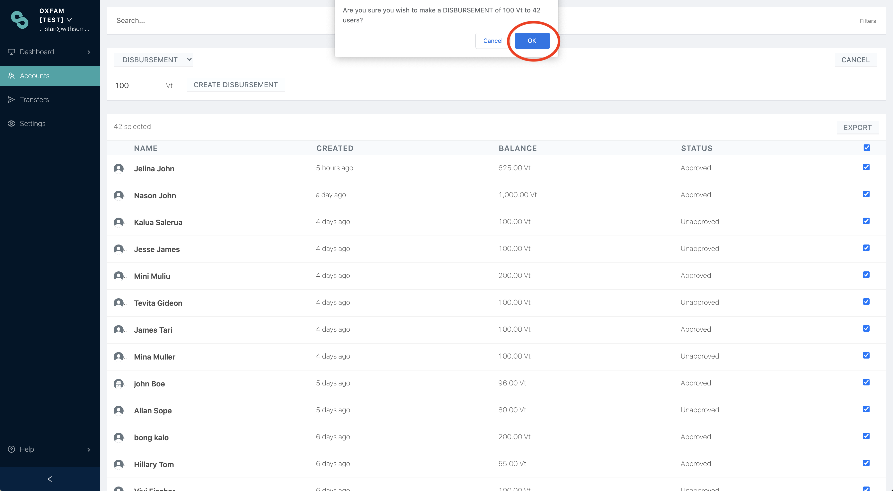

# Disbursing to beneficiaries


**Note:** Transfers made by an admin will only be _automatically approved_ if the value equals the default amount set on the system. See [Dashboard Settings](../sempo-dashboard/dashboard-overview/dashboard-settings.md). 



Superadmins can approve transfers by following the [Managing Transfers](managing-transfers.md#approving-transfers) guide.


## Setting a default \(ie automatic\) disbursement

This option is only available for superadmins \(e.g. Project Leads\). Steps are:

**Step 1:** Click your name on the top of the menu  
**Step 2:** Click Organisation Settings 

  
**Step 3:** Set up the default amount to be disbursed 

## Disbursing funds to an individual

From the accounts page, select an individual participant \(vendor or beneficiary\) account. 

**Step 1:** On an Individual Vendor/Beneficiary Account, click “New Transfer” button.

* **Step 2:** Enter the desired amount. You can also change the transaction type to “Reclamation” or “Balance” \(Sets the user balance\)

* **Step 3:** A dialogue window will pop up. Click “OK” to confirm the transfer

The disbursement will be complete!

## Disbursing funds to a group

* **Step 1:** On the Accounts List Page, select the desired accounts for disbursement


You can combine [Filtering]() and the "Select all" function \(highlighted above\) to disburse to specific groups of people. For example, all beneficiaries who are between the ages of 25-40, female and living in Port Villa.


* **Step 2:** Click "New Transfer"

* **Step 3:** Enter the desired amount. You can also change the transaction type to “Reclamation” or “Balance” \(Sets the user balance\)

* **Step 4:** Click “OK” to confirm the transfer


If you prefer, Sempo can also assist with making transfers to your beneficiaries according to your preferred schedule.




