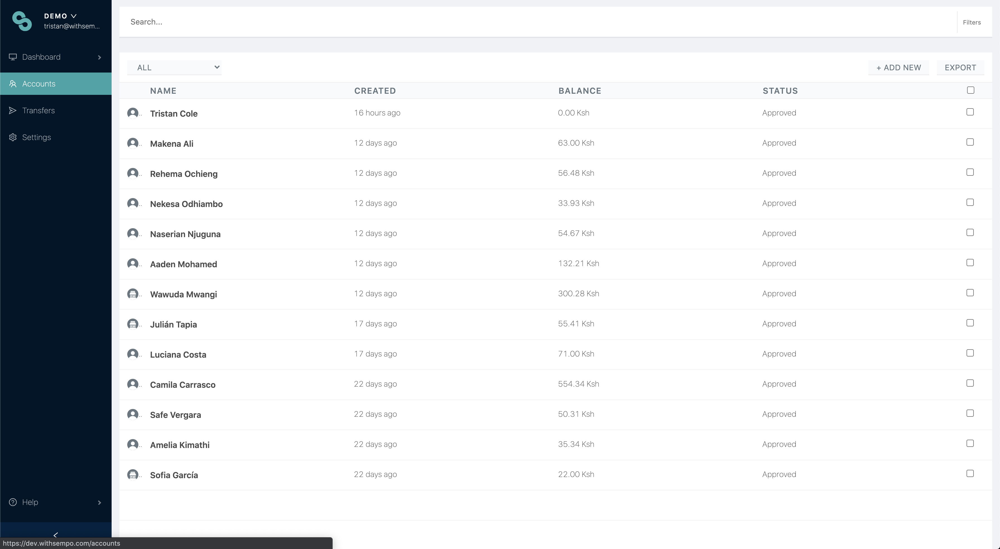
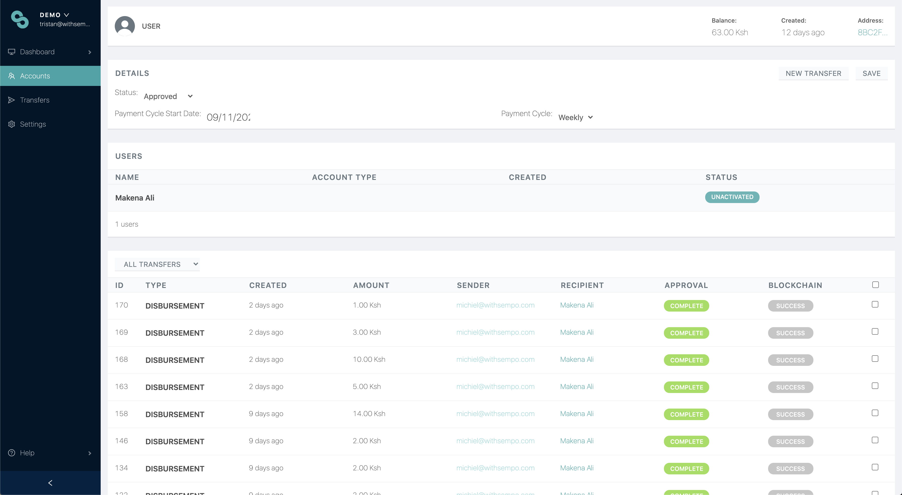

# Managing participants

## ACCOUNTS

Once you have enrolled vendors and beneficiaries into your program, the accounts page should look something like this.

Key Features of this page:

* can select recipient or vendor \(or both\)
* name, when the account was created, how much remaining balance, approved.
* from here, you can add new user accounts.


**Note:** Vendor and beneficiary pages look virtually the same, but may include some different information \(such as store name\). **From the accounts page, you can:**

* Perform a new transfer
* Add/edit user information
* View transaction history and;
* Have multiple users \(e.g. family members, cashiers\) under one account






