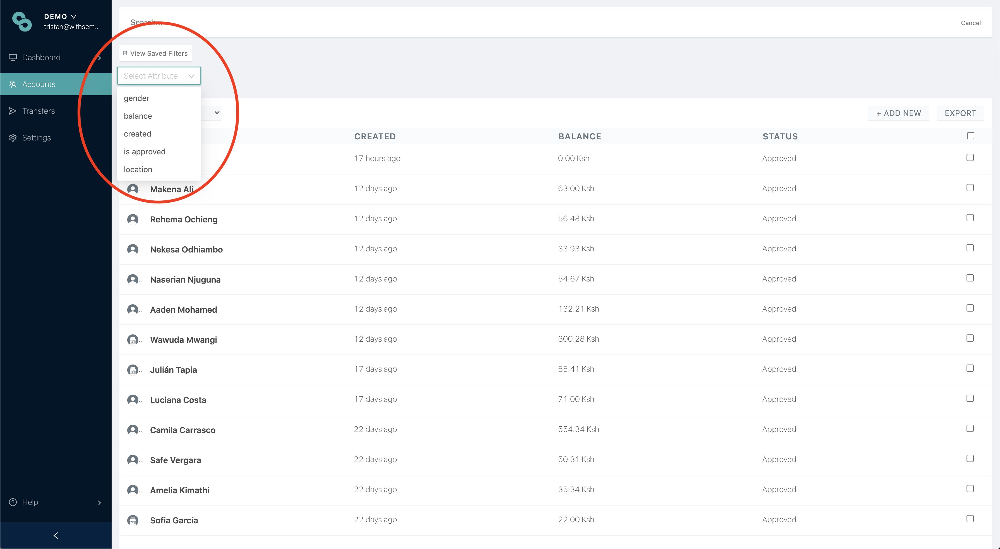

# Filtering

From the accounts page, you are able to filter your searches, by selecting  from the top right hand corner, alongside the search bar. From here, you are able to select the required attributes.



