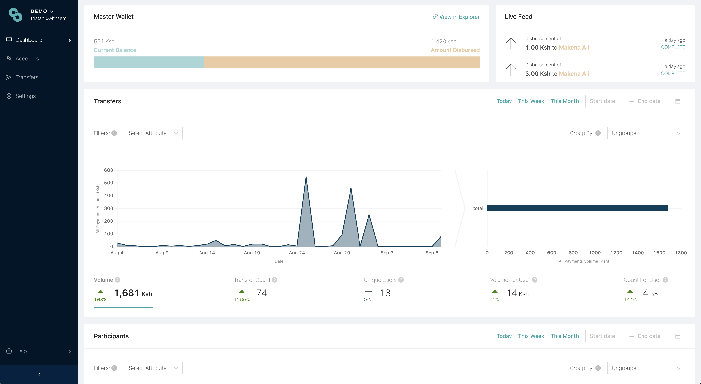

# Dashboard overview

You will use the Sempo Dashboard for registering your program participants, disbursing value to them, and monitoring their transfers.

### **How to navigate the dashboard**



### Tiers: managing access





## Analysing data



