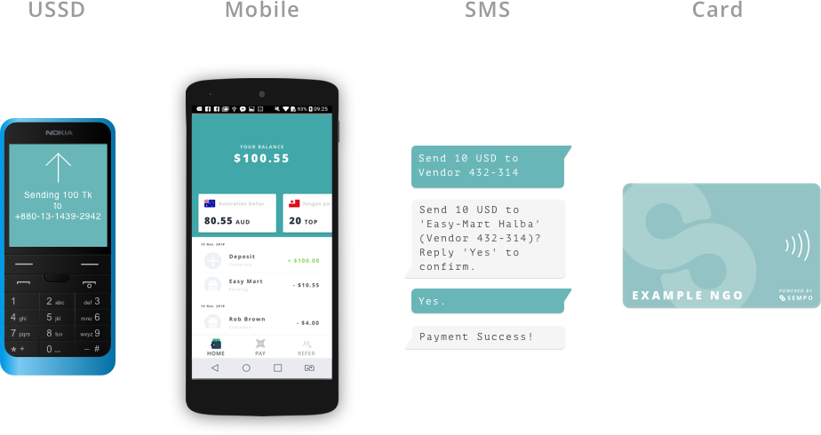

# Sempo Products Explained

## The Hardware

The Sempo platform uses three types of hardware technology, 

1. A feature phone, for payments via USSD interface or SMS interface
2. An NFC enabled Android Device to access the Sempo App, and make payments
3. A Near Field Communication \(NFC\) card, to store users balance and make purchases

At this time, we only support Android devices \(iOS coming late 2020\). In order to process card payments, Android phones must be NFC compatible.

## The Platform

The Sempo platform is run on a server which performs core functions and connects to the Ethereum blockchain, referred to as the Dashboard or the Platform. 


The Administrator Dashboard can be accessed via Desktop or Mobile. 


The Near field Communication \(NFC\) card is used primarily because it is a portable, familiar way to pay for goods and accept payments. The card is encrypted with the users unique code, so that it securely holds the balance of the users digital wallet.

When you order a batch of NFC cards, they are synced to your dashboard for use immediately. They can work in low or no connectivity environments for extended periods of time, until such time as the vendor wishes to be repaid.

