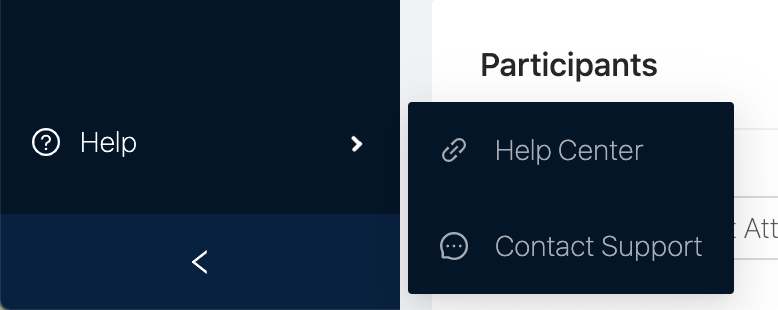

# Support

**The fastest and easiest way to get help is on our help centre and documentation.**




**There are two ways to get further customer support from Sempo:**

1. Message us on the live chat on the app
2. Email us at [help@withsempo.com](mailto:help@withsempo.com)


## How to access Live Chat

Get in contact with our business hour support by clicking “Contact Support” within the dashboard.

 

