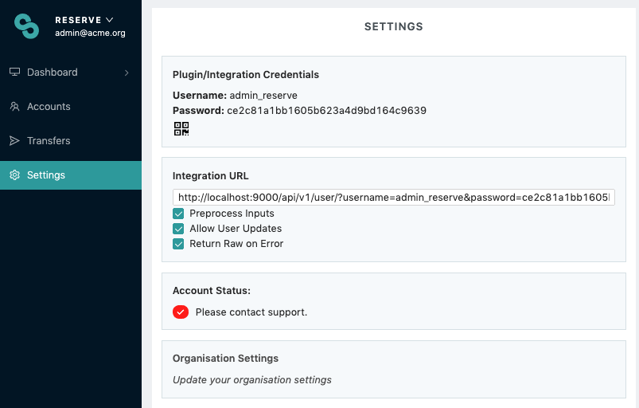

# Commcare

## How can Sempo integrate with Commcare?

Sempo can integrate to use Commcare for three forms:

1. **Participant Enrollment** This form will be used to add each beneficiary to Sempo. 
2. **Vendor Enrollment** This form will be used to add each vendor to Sempo. 
3. **Vendor Know-Your-Customer** This form will be used to add vendor identity information to Sempo. It is separate to the Vendor Enrollment form, because we may need to collect further information about the vendor. For example, if a vendor’s drivers license does not match their bank details. This means you can re-submit this form multiple times, _as long as the Vendor Phone does not change_. 

## Creating a Commcare Form

You can create a survey to import data into Sempo using Commcare's survey creation tools.  

There are three types of fields which Sempo recognizes based on the _Question ID_ set in the form builder. Note that you can set the display text to any input, as long as the _Question ID_ matches, the field will be recognized by Sempo.

#### Required Fields

For **Beneficiary and Vendor enrollment** the required fields and question types are:

* **“first\_name” - Text:** The participant’s first name
* **“last\_name” - Text:** The participant’s last name
* _One of:_
  * **“Phone” - Text:** The participant’s phone number \(must be a valid phone number\)
  * **“public\_serial\_number”- Text:** The ID of the Touch-to-pay card that is being given to the participant \(use the Barcode/QR Code type\)

#### Optional Fields

Optional fields are fields which are not required by Sempo to import a participant, but could be useful include:  

* **"location" - Text**: The text location of the user. This can be a full address, or just a town name
* **"gps\_location" - GPS**: The GPS coordinates for a participant
* **“is\_vendor” - Checkbox:**  whether the participant is a Vendor or Beneficiary. Defaults to “false” if not provided.

#### Custom Fields

If there is an attribute you would like to track, but is not included in Sempo's Required or Optional fields, you can still include them in your form and have them attached to a participant on the Sempo platform! Simply create a question with any question\_id you like, and it will be used as a custom attribute.

## Linking a form to Sempo

### Step 1 - Get your Commcare Credentials:

1. Go to your Sempo deployment \(app.withsempo.com\)
2. Click ‘Settings’ on the side bar.
3. Find the box titled ‘Integration URL’. 
4. Ensure the "Preproces Inputs", and "Return Raw on Error" boxes are checked.  
5. Copy the integration URL from the textbox.

#### Allow Modifications

The Kobo integration can be configured to allow modifications to existing users. If you submit a form that has the same Phone or Card ID as an existing user, it’ll update the existing user’s settings. This is useful for providing more KYC information at a later date


WARNING: This setting should only be turned on when it’s needed, as it makes it easier to accidentally use the same Touch-to-pay card twice on two different users.


To turn this setting on, ensure "Allow User Updates" is checked in step 4, in addition to the other required fields.

### Step 2 - Add API Details

To connect your completed form to Sempo, you must first add Sempo to the possible connection settings.

1. First navigate to your _Project Settings_ page

2. From the project settings page, navigate to the _Connection Settings_ page, and press the _Add Connection Settings_ button. 

3. When you get to the _Remote API Connections_ page, fill out the form as follows: 

**Name**: Whatever you would like to Commcare to refer to your Sempo deployment as. For this example, I am using "Sempo Integration"

**Address to send notifications**: An email address, or list of email addresses, where you would like to send notifications. If something goes wrong while importing users from a form, these addresses will receive diagnostic data.

**URL**: This is the URL obtained from the Sempo settings page in Step 1

**Auth Type**: Select none here, as the authentication token is embedded in the URL. 

**Skip certificate verification**: Leave this unchecked for production Sempo deployments

## Step 3 - Link a Commcare Application to Sempo

Finally, you can put it all together and link your Commcare application to Sempo! 

1. Navigate to the Data Forwarding page from the Project Settings page. From there, press the _Add a service to forward to_ button under the _Forward Forms_ heading.

2. Here, select the name of the API Connection created in Step 2. Be sure to set the _Payload Format_ to JSON, and also ensure that _Include 'app\_id' URL query parameter_ is checked. Once filled out, you can press _Start Forwarding_

3. Congratulations! Your Commcare Application is now configured to push data to the Sempo platform! 

