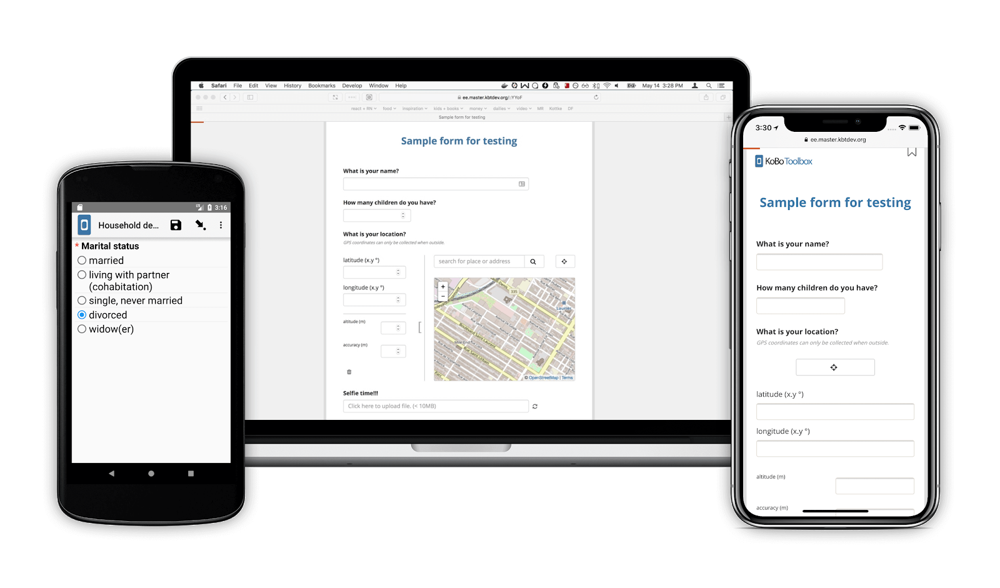
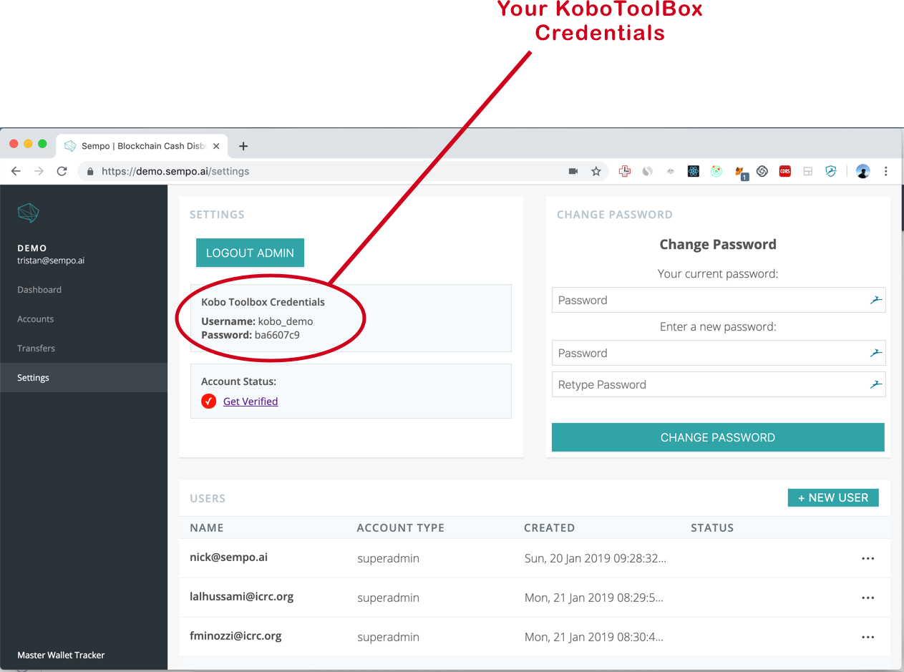
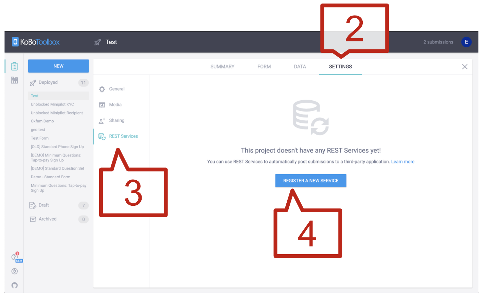
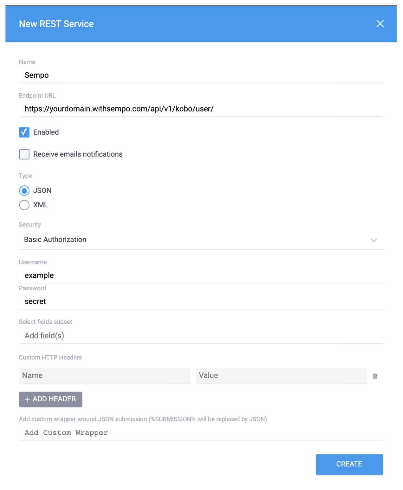
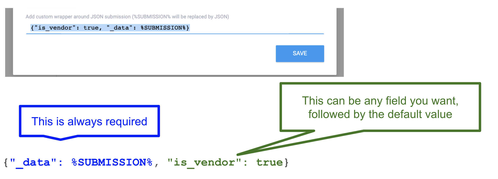

# KoboToolbox

## yWhat is Kobo Toolbox?

* Kobo Toolbox is a data collection tool specially designed for Humanitarian Work
* It allows for creation of sophisticated forms
* Kobo’s Android App can be used to collect data without internet
* Sempo can automatically sync with Kobo, so no manual upload is required

## How can Sempo integrate with Kobo Toolbox?

Sempo can integrate to use Kobo Toolbox for three forms:

1. **Beneficiary Enrollment** This form will be used to add each beneficiary to Sempo. 
2. **Vendor Enrollment** This form will be used to add each vendor to Sempo. 
3. **Vendor Know-Your-Customer** This form will be used to add vendor identity information to Sempo. It is separate to the Vendor Enrollment form, because we may need to collect further information about the vendor. For example, if a vendor’s drivers license does not match their bank details. This means you can re-submit this form multiple times, _as long as the Vendor Phone does not change_. 

## Creating a Kobo form

You can create your Kobo Form using Kobo’s web interface. How Sempo treats a field depends on its category.

_**Required fields**_ are fields that you **MUST** include in a form and must fill out in order for the data to be synced. The fields are not case sensitive, but they must match Sempo’s documentation. For example, for the required field “_phone_”, you CAN provide “Phone” but cannot provide “Phone number”. **But**, you can override this using XML, the ‘Data Column Name’ or some special features \(more on this later\)

_**Optional fields**_ are fields that are not required, but treated specially by Sempo. For example if you provide a “location” such as “Port Vila”, sempo will try to find the GPS location for “Port Vila”. Like required fields, you must match name in the Sempo documentation.

_**Custom fields**_ are any fields that are not **required** or **optional**. Sempo will save these fields as “Custom Attributes” for each user, allowing you to filter and group users according to this information. You can use any name you want for a custom field.

### Required Fields

For **Beneficiary and Vendor enrollment** the required fields are:

* **“first\_name”:** The participant’s first name
* **“last\_name”:** The participant’s last name
* _One of:_
  * **“Phone”:** The participant’s phone number \(must be a valid phone number\)
  * **“public\_serial\_number”:** The ID of the Touch-to-pay card that is being given to the participant \(use the Barcode/QR Code type\)


Make sure to include the underscores in the field names!


For **Vendor KYC** the required fields are:

* **“Phone”:** The same phone number provided in the sign up form
* **“Photo ID”:** A photo of the Vendor’s Identity Card \(Drivers License etc\)
* **“Selfie”:** A photo of the Vendor, holding up their Photo ID
* **“Supporting ID”:** A photo of a supporting Identity Document such a bank statement **IF** the vendor is accepting more than **5,000 AUD a week** \([https://docs.withsempo.com/policies-and-security/faqs\#what-are-sempo-account-limits](https://docs.withsempo.com/policies-and-security/faqs#what-are-sempo-account-limits)\)

There are many optional fields. The fields that might be useful are:

* **“Is Vendor”:** \(Checkbox only\) - whether the participant is a Vendor or Beneficiary. Defaults to “false” if not provided.
* **“Location”:** The text address or town of the participant, for example “Pango”
* **“GPS”:** The GPS coordinates of the participant, provided using Kobo’s “Point” field.

## Linking a form to Sempo

### Step 1 - Get your Kobo Credentials:


**Note:** your sub-domain might be different for your organisation


1. Go to your Sempo deployment \(app.withsempo.com\)
2. Click ‘Settings’ on the side bar.
3. Find the box titled ‘Kobo Toolbox Credentials’. 
4. Copy the Username and Password.

### Step 2 - Connect your Form

1. Make sure your form is deployed on KoboToolbox.
2. In the form you would like to connect, go to ‘Settings’.
3. Next, go to ‘REST Services’
4. Click ‘Register a new service’

1. Complete the following fields:
2. Name: Sempo
3. Endpoint URL: [https://yourdomain.withsempo.com/api/v1/user/?preprocess=true](https://yourdomain.withsempo.com/api/v1/user/?preprocess=true)
4. Ensure ‘Enabled’ is CHECKED
5. Type: JSON
6. Security: Basic Authorization
7. Username: your username from Step 2.
8. Password: your password from Step 2.
9. Scroll down and click ‘Create’
10. You have now connected your KoboToolbox form to Sempo!

## Advanced Kobo Integration Features

### Default Values

We now support Default values on a per-form level. This means that unlike last time, enrollers don’t need to select “is vendor”: “true” every time they sign up a person:

To add a default value, add a custom wrapper, for example `{"_data": %SUBMISSION%, "is_vendor": true}` at the bottom of the “Add Rest Service” section.

You can add anything you want as a default value. Don't forget that you always need to include `"_data": %SUBMISSION%`!

### Field name overrides

Any field name can be overriden on a case-by-case basis. This is useful for supporting groups, which add the group name to every field

For example if the group was “Identity Information” and the Field was “Phone”, Kobo will submit this as

“**Indentity\_Information\_Phone**”

This can be manually updated on Sempo to be recognised as just “**Phone**”.


For now, this needs to be done by a Sempo team member.


### Allow Modifications

The Kobo integration can be configured to allow modifications to existing users. If you submit a form that has the same Phone or Card ID as an existing user, it’ll update the existing user’s settings. This is useful for providing more KYC information at a later date


WARNING: This setting should only be turned on when it’s needed, as it makes it easier to accidently use the same Touch-to-pay card twice on two different users.


To turn this setting on, add “&allow\_as\_update=true” to the webhook URL. For example: `https://yourdomain.withsempo.com/api/v1/user/?preprocess=true&allow_as_update=true`

### Return raw data on error

Sometimes it can be useful to know what Kobo is actually sending to the system. We now have a setting that will return a message containing exactly what Kobo sent, if there’s an error. To turn this setting on, add “&return\_raw\_on\_error=true” to the webhook URL. For example: `https://yourdomain.withsempo.com/api/v1/user/?preprocess=true&return_raw_on_error=true`

### Putting it all together

You can combine any of the above advanced settings together in a single webhook URL. For example: `https://yourdomain.withsempo.com/api/v1/user/?preprocess=true&allow_as_update=true&return_raw_on_error=true`

