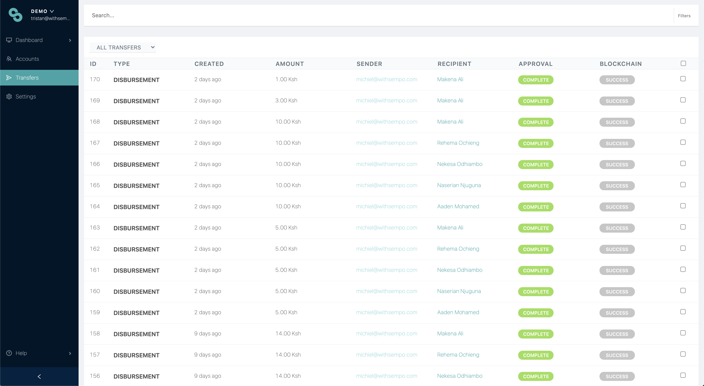
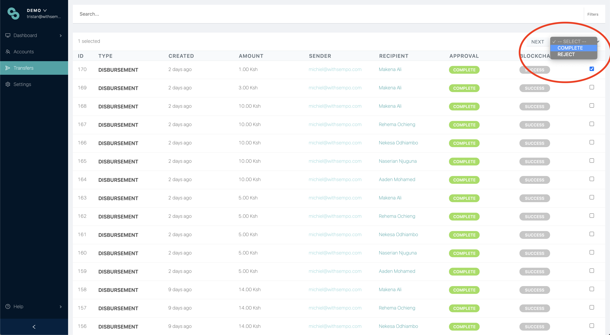

# Managing transfers

By selecting the transfers tab on the left, you are able to see the full history of transactions, including payments, disbursements and withdrawals, which can be filtered.

## Approving or Rejecting Transfers

1. Go to the Transfers Page
2. Select the transfer by clicking the box on the right of the page.
3. Select “COMPLETE” \(top right dropdown\)
4. Click “NEXT” to resolve the transfer


**Note:** Superadmins can set the default transfer amount in their [organisation settings](../sempo-dashboard/dashboard-overview/dashboard-settings.md)


