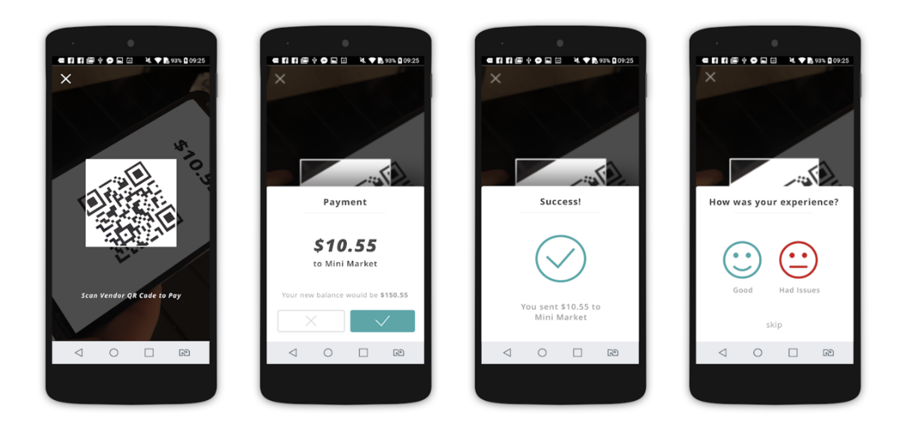

# Using the app as a beneficiary


For guidance on how to register and train beneficiaries, please see below [beneficiary registration and training pages.](../registering-vendors-and-beneficiaries/overview-of-registering-beneficiaries/)



Note: Please check with your Program Manager whether the beneficiaries in your program will be using the Sempo app to make payments, text-based messaging or only contactless cards. &#x20;



[app-navigation.md](app-navigation.md)


## How to send money in person?

1. Open the Sempo App and select **Transaction Mode**&#x20;
2. Use a slider on top of the screen. **Slide it to the left.** .png>)&#x20;
3. **Scan the QR Code** on the other persons device
4. Check the amount, if you are happy to proceed, **confirm the transaction.**
5. **Hooray!** You've just sent money to the other person.&#x20;


If you don't have internet, but the other person does, you will still be able to make a [secure transaction](using-the-app-as-a-beneficiary.md#how-to-send-money-in-person-offline)


## How to send money in person (offline)?

1. Open the Sempo app and click the **transact mode** &#x20;
2. Use a slider on top of the screen. **Slide it to the middle.** &#x20;
3. **Enter the amount** you wish to cash out and click **send.**\
   &#x20;**** &#x20;
4. **Show the QR code** to the person. The code contains the details of the transaction and works offline.
5. &#x20;
6. **Hooray!** You've just sent money to the other person, while you've been offline.

## How to send money to someone?

1. Open the Sempo app and click the **transact mode** &#x20;
2. Use a slider on top of the screen. **Slide it to the middle.** &#x20;
3. **Enter the amount** you wish to send and click **send.**\
   &#x20;**** &#x20;
4. Enter **** the persons phone number or blockchain address and **click "send to user".******
5. **Hooray!** You've just sent money to the other person.&#x20;

