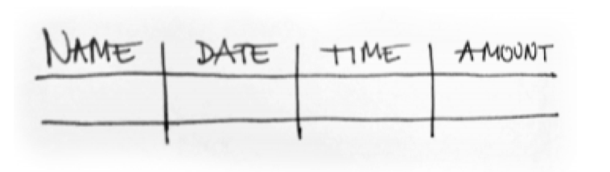

# Using the app as a vendor

## How to use the app?

1. **Open** by clicking on the Sempo icon  
2. **Login** by entering your phone number and the PIN code that you received by SMS. Click **Login** to proceed.
3. **Passcode.** Next time you open the app you will be asked to enter your **Passcode.** Choose a code that is easy to remember and secure. Don't tell anyone.



## How to check balance?

1. Open the Sempo App and select **Transaction Mode** 
2. Use a slider on top of the screen. **Slide it to the left.**  
3. **Scan the QR Code** on the back of the card.   
4. **Show the balance of the card** to the beneficiary.

## How to accept payments?

1. Open the Sempo app
2. Select **Transaction Mode**  
3. Use a slider on top of the screen. **Slide it to the left.**  
4. **Enter the total amount** of purchases that the beneficiary wishes to make. Click **Charge**.  
5. **Select categories** of all products/services being purchased. If unsure, select "Other". Click **Next.**  
6. On the next screen, below the QR code click on **Tap NFC Tag**.  
7. Ask the beneficiary to **Tap the card** anywhere on the phone and hold for 5 seconds  
8. A **Confirmation** screen will appear once the transaction is completed.  

In the case of **no internet connection**, the balance will update once the connection is restored. Simply go to your wallet screen  and touch the balance field and pull it down to refresh.



## How to cash out?

_Do you need cash sooner than the agreed pay cycle?_

1. **Go to another vendor** and check if they can pay the cash out in the amount you asked for.
2. Open the Sempo app and click the **transact mode**  
3. Use a slider on top of the screen. **Slide it to the middle.**  
4. **Enter the amount** you wish to cash out and click **send.**   
5. **Show the QR code** to the vendor. The code contains the details of the transaction.  

## How to **pay cash out?**

1. Open the Sempo app and click the **transact mode** 
2. Use a slider on top of the screen. **Slide it to the left.**  ****Position the code in a way that fits in the square on the screen.
3. **Payout cash** in the amount you received in your digital wallet.  
4. **Register in your books.** Remember to register the pay out in your own books.  

## Refunds

If a vendor needs to refund a recipient \(eg. if they accidentally overcharged\), the vendor needs to:

1. Notify the organisation managing the cash transfer program who will perform a reclamation of the amount
2. The organisation will then disburse that amount to the recipient.

