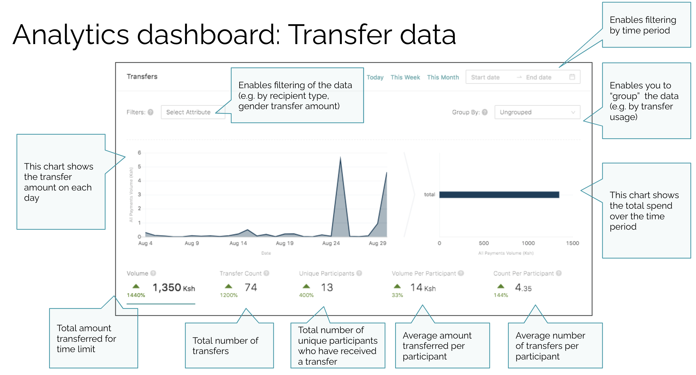

# Analysing participant and transfer data

The Sempo analytics dashboard can be used to analyse participant and transfer data. It is also possible to [export a spreadsheet](exporting-to-excel.md) of all payments for further analysis in excel.

It is also important to conduct on-the-ground monitoring to ensure that the program has not resulted in adverse effects, such as beneficiaries being taken advantage of by vendors, or domestic violence due to the distribution.

## Analytics Dashboard Overview

The analytics page includes:

1. A "Master Wallet" that summarises the total amount disbursed, and total amount remaining
2. A Live Transaction Feed \(showing payments in real-time\)
3. A section to analyse Transfers 
4. A section to analyse Participants

## Master Wallet

The Master Wallet displays:

* “Current balance” \(being the funds the NGO has in its Sempo Wallet for distribution to participants\)
* “In Circulation” amount \(all funds that have already been distributed to vendors and beneficiaries on their cards or Apps\), and 
* “Withdrawn” \(the amount that has been withdrawn from the Sempo Platform, representing the amount of fiat currency transferred to vendors\) 

## Live Feed

The Sempo Dashboard displays real-time payment transactions on the “Live Feed”:

This “live feed” of real-time transactions can be minimised by clicking on the arrows on the top right of the Live feed.

## Analysing Transfers

The Transfer section enables powerful analysis of all transaction records, by any custom attribute you upload data on. Within the Transfers section, you can:

* Filter the displayed data by any attributes \(e.g. gender of participant, what the participant spent the funds on “transfer usage”\)
* Group the data by any attributes \(e.g. transfer usage, participant type etc\). When you group, the segmented data will appear on the charts in this section
* Select the time period you want to analyse
* Change the charts to display different desired metrics - in particular: 
  * Click “Volume” to see the total amount transferred over the selected time period 
  * Click “Transfer Count” show the total number of transfers over the time period
  * Click “Unique Participants” to show unique participants over the time period
  * Click “Average Volume” to see average volume of funds transferred per participant over the time period
  * Click “Average Count” to see average number of transfers per participant \(over the time period\)

This enables complex and powerful queries to gain new insights into how your programs are performing for monitoring and evaluation. 

> For example, you could generate a query that **displays transaction volume over the current month**, grouped by **transfer usage**. You could filter this data to only display participants who are between the **ages of 25-40**, **female, in the town of Port Villa.** Then you could see what they have used their transfers for \(e.g. buying healthcare items, vs long-life food\)

## Analysing Participants 

Within the Participants section, you can also:

* Select the time period you want to analyse participants from
* Filter Participant Data 
* Group Participant data
* See total Active participants, over time \(click "Active Participants"\)
* See New Participants, over time \(click "New Participants"\)

