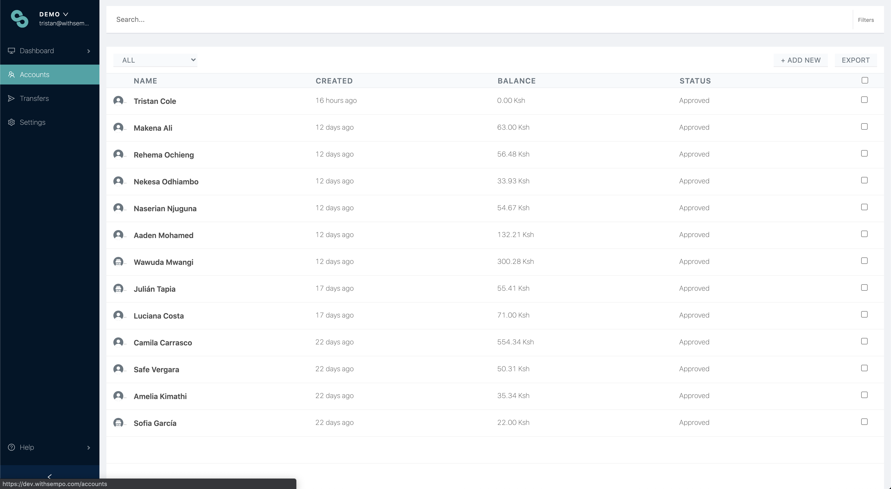
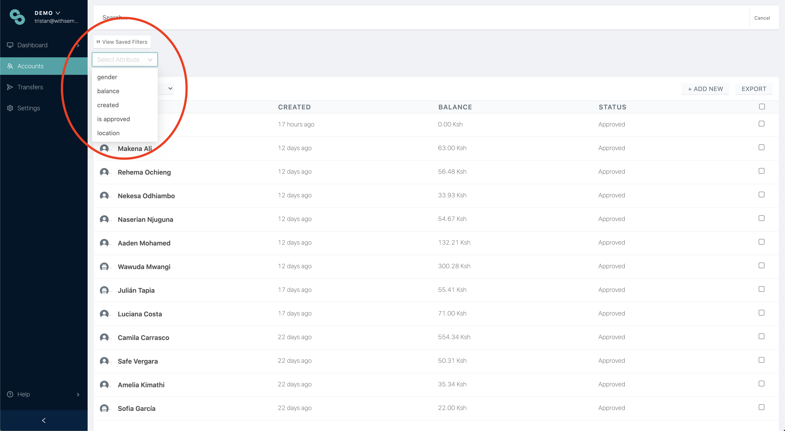
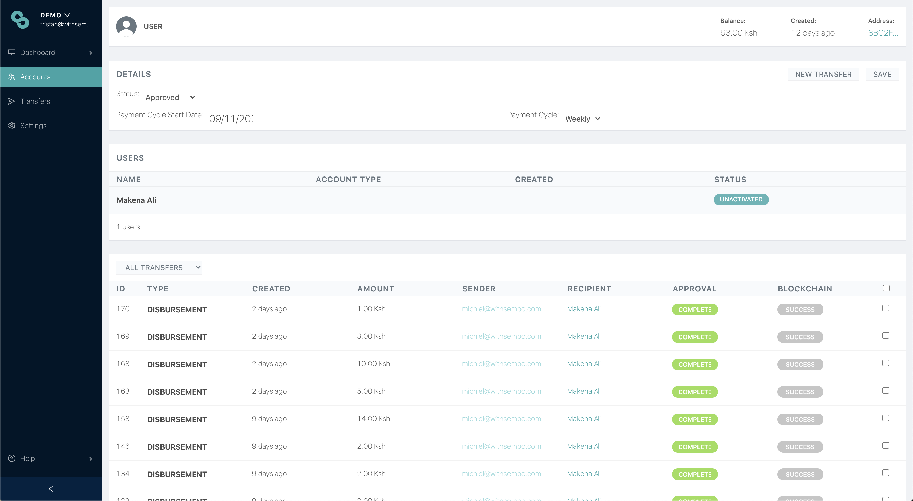

# Viewing, filtering and editing participant accounts

## Viewing **the** accounts page

Once you have enrolled vendors and beneficiaries into your program, the accounts page should look something like this.

Key features of this page are:

* You can select beneficiaries or vendors \(or both\)
* You can search for names
* You can see when accounts were created, and how much remaining balance is left
* You can add new user accounts
* You can also [export participant data into a CSV file.](exporting-to-excel.md)

**Note:** Vendor and beneficiary pages look virtually the same, but may include some different information \(such as store name\). 

## Filtering

From the accounts page, you are able to filter your searches, by selecting  from the top right hand corner, alongside the search bar. From here, you are able to select the required attributes.

## Viewing specific accounts

From the accounts page, you can click in the row of a participant, to be taken to the specific accounts page for that participant. From this page you can:

* Add/edit user information
* View specific transaction history
* Perform a new transfer


You can register multiple users \(e.g. family members, cashiers\) under one account, if preferred.




