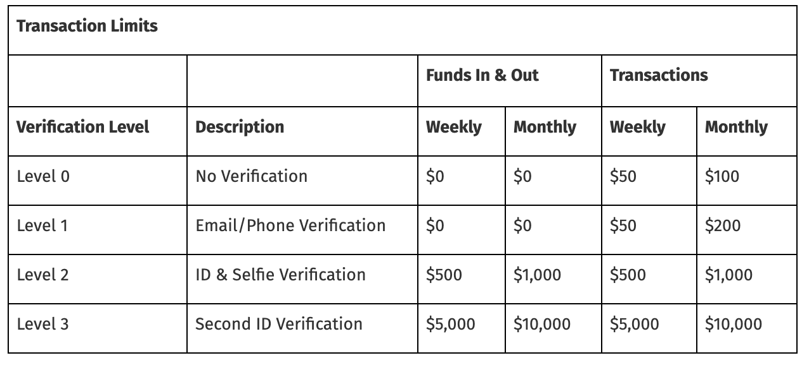

# Security FAQs

## What are Sempo Account Limits?

We implement strict velocity exchange limits, ensuring that the rapid exchange of a large amount of currency is impossible for a single individual or small group of individuals. In addition, there are transaction limits in place to ensure that only fully verified users have access to the full service. Please note, Level 0 and Level 1 do not apply to vendors.

_Amounts quoted in Australian Dollars \($AUD\)._

## What is a KYC check and who needs to do it?

A Know Your Customer \(KYC\) check is required to be passed by all Vendors using the Sempo platform.

Vendors who exchange their digital tokens for fiat \(via bank transfer\) are required to undertake these checks to ensure compliance with Sempo's Anti-Money Laundering and Counter Terrorism policy.

A KYC check of a Vendor involves providing the following documentation

1. Business name
2. Customers full first and last name \(as it appears on legal documents\)
3. Date of birth OR residential address

For documentary verification, we accept the following

* original or certified copy of a primary photographic identification document, such as a driver’s licence or passport; or
* original or certified copy of non-photographic identification document, such as a birth certificate or citizenship certificate AND a secondary identification document, such as a notice from the ATO or the Commonwealth, or from a utilities provider with the individual’s residential address.

We only accept an identification document that has not expired \(the exception to this is an Australian passport that has expired within the preceding two years\). 

If we use an electronic-based verification process, we verify the following using reliable and independent electronic data:

* customer’s name from at least two separate data sources; and
* customer’s residential address and/or date of birth from at least two separate data sources. 

We are integrating into multiple third-party identity and document verification providers such as Trulioo and Equifax. Both providers offer reliable in-class document verification services using advanced scanning tools and extensive data sources.

For high-risk customers, we conduct further KYC and due diligence.

This will depend on the client and the particular reason for the high-risk rating. For example, we may take the following additional KYC steps for high risk individuals:

* any other names that customer is known by;
* customer’s countries of citizenship or residence;
* customer’s occupation nor business activities;
* income or assets of the customer; or
* beneficial ownership of funds.

## How is Sempo regulated?

Sempo is registered with the Australian Transaction Reports and Analysis Centre \(AUSTRAC\) as a Digital Currency Exchange \(DCE\) 100617044-001

Sempo is categorised under Australian legislation as the definition of Item 50A \(Digital Currency Exchange\)- exchanging digital currency for money \(whether Australian or not\) or exchanging money \(whether Australian or not\) for digital currency, where the exchange is provided in the course of carrying on a digital currency exchange business. 

As such, Sempo is subject to stringent regulations and requirements with respect to managing the risk of potentially being used to facilitate money laundering, terrorist financing or other criminal activity. It is our responsibility to effectively identify and mitigate risks to protect our users.

## How safe is it to send money through Sempo?

Sempo has a number of risk management and fraud detection systems:

● Two-factor authentication for administration dashboard;

● Device authorisation;

● Device fingerprinting and whitelists;

● Forced SSL Encryption for external server communications;

● Strong client passwords requirement;

● Biometric confirmation for operations \(device dependent\);

● API authentication using JSON Web Tokens;

We adhere to the Australian Privacy Principles contained in the Privacy Act 1988 \(Cth\) and to the extent applicable, the EU General Data Protection Regulation \(GDPR\).

