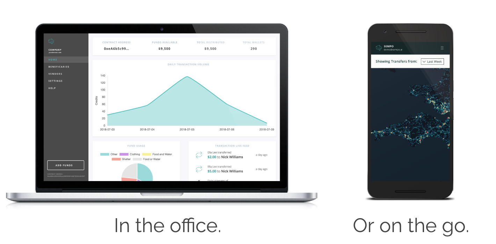

# What does Sempo provide?

## Sempo's Payment Options 

Sempo can provide three types of payment options:

1. **The Sempo Android app.** This can be used by vendors to receive payments from beneficiaries, for peer-to-peer or government-to-person transfers. Our app can run on any Android phone with "Near Field Communication" \(NFC\) technology. 
2. **USSD/SMS text-based messaging.** This option can run on any feature phone. This means beneficiaries can send digital currency with something as simple as an SMS text message.
3. **A contactless "tap-to-pay" card.** These cards can be used to make a purchase from a vendor, simply by tapping the card against the vendor's phone - even if there is no internet connection at the time. \(Our cards are NFC-enabled, and securely store the balance of the beneficiary's wallet on the card.\)

At this time, we only support Android devices. 

When you order a batch of contactless "tap to pay" cards, we can make sure they are synced to your particular dashboard for use immediately. \(During enrolment of your beneficiaries, you or your Field Partner will be able to sync a particular card to each particular beneficiary.\) 

## The Sempo Dashboard 

Sempo will set up a specific version or "instance" of the Sempo Platform for your organisation and cash transfer program.

You will then be able to use the Sempo Administrative Dashboard to register your program participants \(vendors and beneficiaries\), disburse money to your participants, and monitor how they are spending their money. 

The Sempo Dashboard can be accessed via Desktop computer or by Mobile.


The Sempo Platform connects to a public blockchain. This makes financial reporting very easy for our partners.


## Operational, financial and technical support 

Sempo is not just a software and hardware provider. A significant part of the benefit that we offer is our capacity to work with you to deliver cash aid in an inclusive, user-friendly, secure and cost-efficient manner, no matter the context and constraints.

Please reach out to us to discuss your needs.

