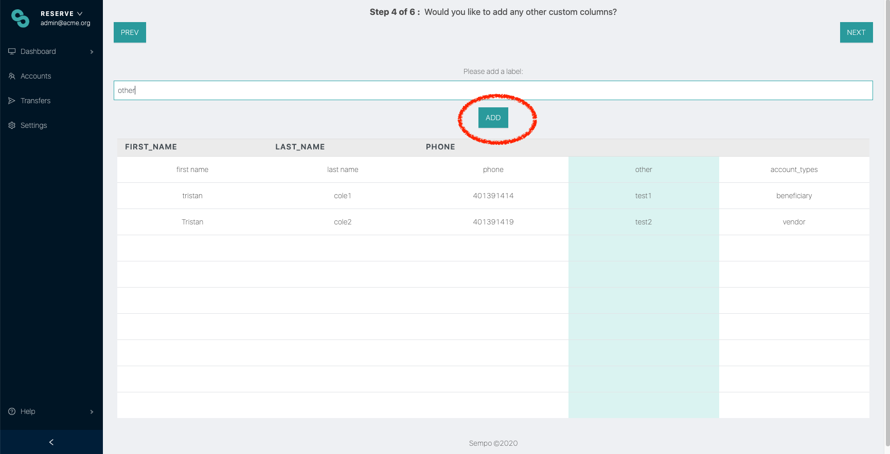
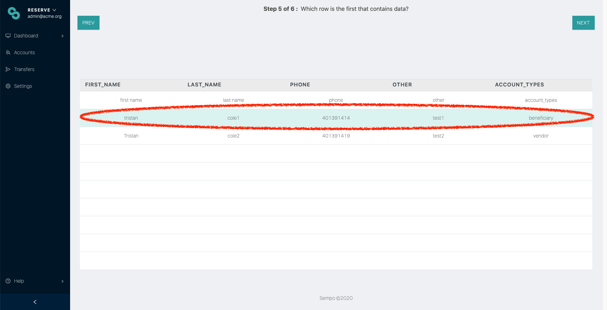
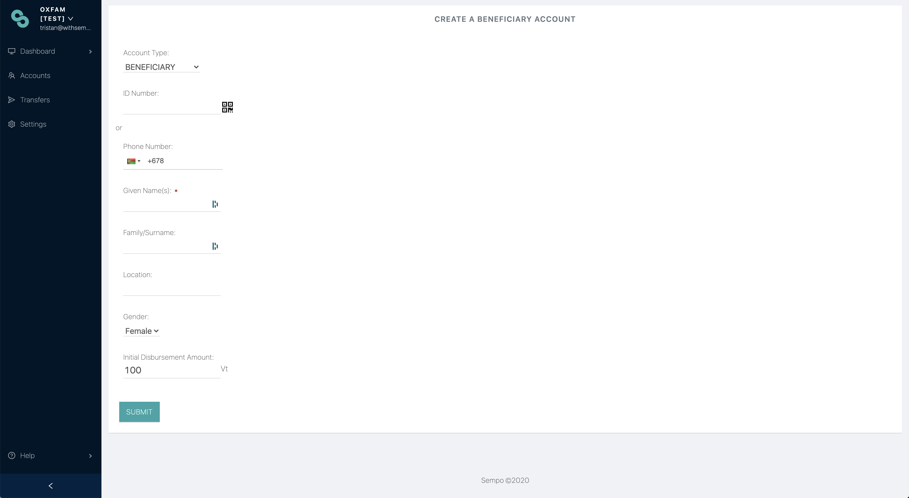

# Overview of ways to register participants

Once you have identified participants for your program, you will be wanting to register them as participants. Sempo enables four ways to register participants so that their details appears on the Sempo Dashboard

1. Kobo Toolbox
2. Spreadsheet Upload&#x20;
3. Manually adding participants to the Sempo Dashboard&#x20;
4. Self Sign Up by Participants (if enabled)

Please discuss with us which method you would prefer, so we can help you deliver this process.

## 1. Kobo Toolbox

If you collect information via a KoboToolbox form, Sempo can sync the data collected by these forms automatically to the Sempo Dashboard. You can either:

* Sync the upload of your KoboToolbox form with Sempo via our [Integration](../integrations/kobotoolbox.md#linking-a-form-to-sempo) (ask team@withsempo.com if required!); or&#x20;
* Email us the CSV of the data, and we can upload the data for you

See further:


[kobotoolbox.md](../integrations/kobotoolbox.md)



[overview-of-registering-beneficiaries](overview-of-registering-beneficiaries/)



[quick-overview-of-enrolling-vendors](quick-overview-of-enrolling-vendors/)


## 2. Spreadsheet Upload&#x20;

You may decide to collect details on participants by filling out a spreadsheet (e.g. CSV or Excel file).&#x20;

If you wish to enroll participants whose details are stored in a spreadsheet, follow the below steps

* **Step 1:** Go to the “Accounts’’ tab

.png>)

* **Step 2:** Select "Import", as described above.

.png>)

* **Step 3:** This time, click on “Upload XLSX/CSV”

* **Step 4:** Click or drag to upload the spreadsheet

* **Step 5:** Follow the prompts by selecting each column that matches.

* **Step 6:** You can add custom columns as required and edit labels.&#x20;

* **Step 7:** Finally, select the _first row_ of user data.

Spreadsheets must contain columns with:&#x20;

* recipient's first names,&#x20;
* recipients last names and;&#x20;
* either their phone number or transfer card id.
* account\_types _(custom):_ beneficiary, vendor, supervendor, token\_agent, group\_account

Custom fields such as age and gender can also be added, and used to filter users. Default account types are beneficiaries.

## 3. Sempo Dashboard

**Step 1:** From the Sempo Dashboard, click on Accounts in the side-bar, and then “Import” in the top right hand corner.

.png>)

**Step 2:** Click "Add Individual Accounts"

**Step 3:** Ensure that account type is set to “BENEFICIARY”  (or what you would like your new participant to be)

**Step 4:** Enter the user’s first name,  last name, and whatever other custom attributes your organisation may be tracking.&#x20;

If recipients will be logging into the Android app, add their phone number.  Alternatively, if they will be using a transfer card, you can enter the serial number manually, or click on the QR icon to scan a card using your browser’s camera.

**Step 5:** If you wish to disburse funds immediately, enter an amount. Alternatively, leave the value as 0.


Note: The initial disbursement amount will be set to the default disbursement amount set in the organisation settings ([https://app.withsempo.com/settings/organisation](https://app.withsempo.com/settings/organisation))


**Step 6:** The confirmation screen will show a 4 digit PIN. If participants are using the Android App, tell them this pin, and they can use it along with their phone number to log into the app. Otherwise ignore the pin. This pin will also be sent via SMS to the participant.

The new recipients can now be viewed from the Accounts page!

## 4. Self Sign Up (if enabled)

If you prefer to allow your program participants to self-sign up, Sempo can enable this. We can also help you distribute information to your program participants about how to sign up.

Please see the following guides:


[using-the-app-as-a-beneficiary.md](../mobile-app/using-the-app-as-a-beneficiary.md)



[using-the-app-as-a-vendor.md](../vendor-guide/vendor-guide/using-the-app-as-a-vendor.md)



In addition to collecting data for registering someone as a participant in your program, you may also need to collect data to enable your organisation or Sempo to complete legally mandated[ "Know Your Customer"](../policies-and-security/kyc.md) checks. A participant can be registered but may not be able to receive or transact with funds if their KYC is incomplete.


****

****

