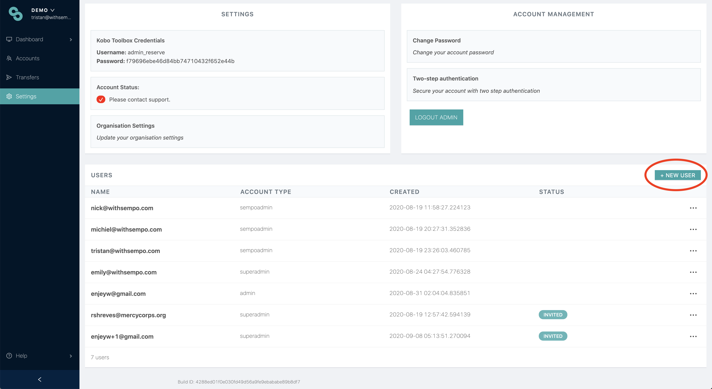
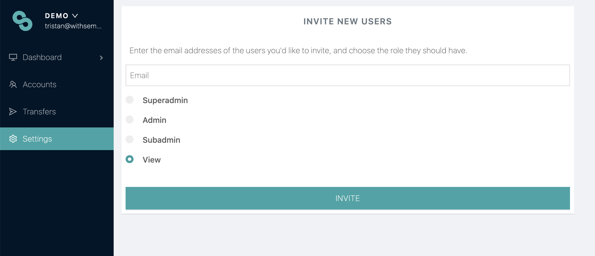

# Inviting someone to access the Sempo Dashboard


**To get access to the dashboard ask your platform administrator to invite you and then** [**sign up**.](how-to-log-in.md) If you need help, please reach out to [help@withsempo.com](mailto:help@withsempo.com).


Superadmins and admins can invite others to join the Sempo Dashboard. To invite others, please:

1. Navigate to the Settings Page 
2. Select ‘+ New User’
3. Enter the New User's email address, and choose their tier. \(See [Access Tiers](access-tiers.md) for guidance if you don't know which tier to invite them to.\)
4. If a user doesn't get an email, try resending it and ask them to check their spam inbox.

Similar to the admin user list action, to manage an email invite, simply click on the 3 dot action icon  of the invite you would like to resend or delete.

