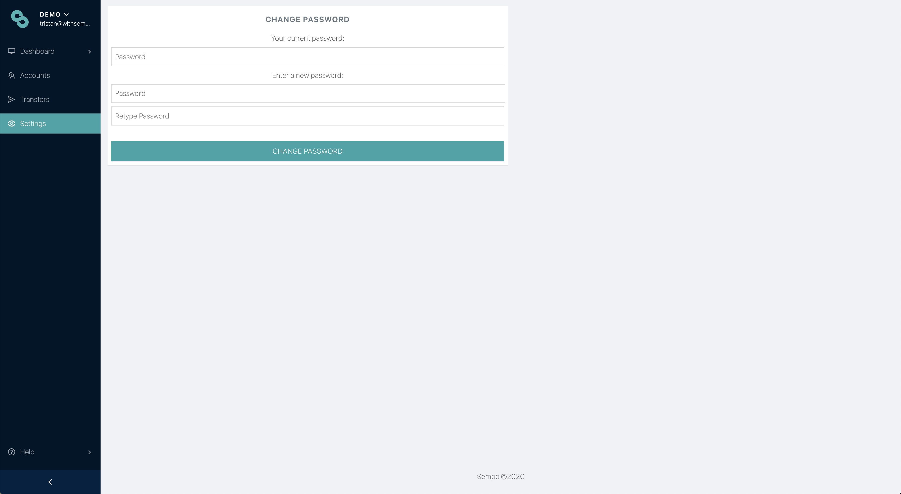

# Resetting your password

To reset your password, go to the settings page, then click "_Change Password_".

This is also directly accessible via [https://app.withsempo.com/settings/change-password](https://app.withsempo.com/settings/change-password)


**Note:** your sub-domain might be different for your organisation


