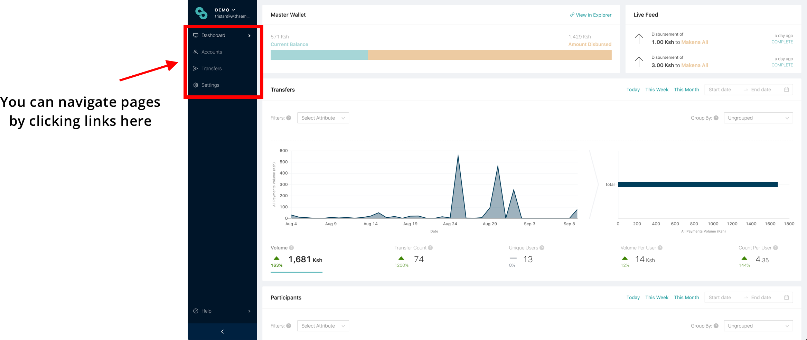
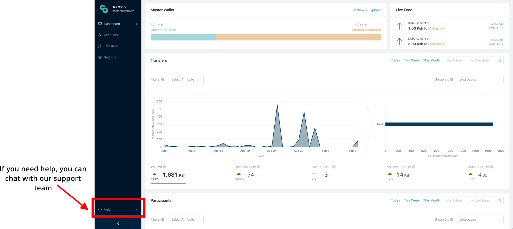

# Dashboard overview

Sempo’s Dashboard has been specifically designed to enable NGOs to better deliver CVA. Our Dashboard contains:

* **Analytics Dashboard** \(the home page, where viewers can see and manage client data, project-level data and real-time payment transaction records\) 
* **Accounts page** \(a list of all program participants with accounts. Clicking on each participant account enables the user to see all attributes and transfer records\)
* **Transfers page** \(a list of all transactions that have taken place\)
* **Settings page** \(where users can invite other colleagues, change administrative access levels of colleagues, change organisation settings etc\)

## **How to navigate the dashboard**

## Analytics Dashboard



### Tiers: managing access





## Analysing data



