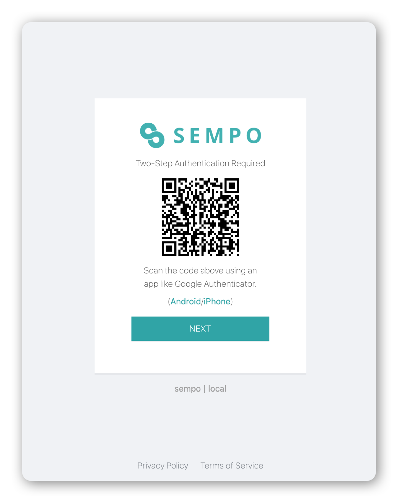
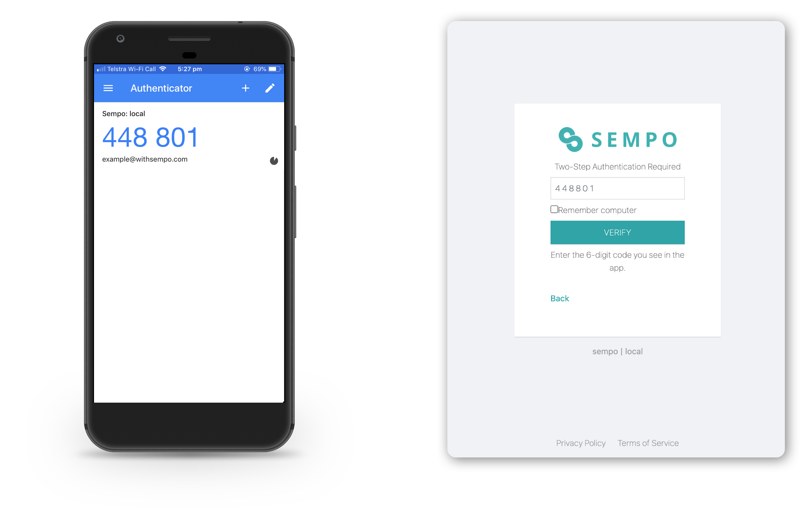
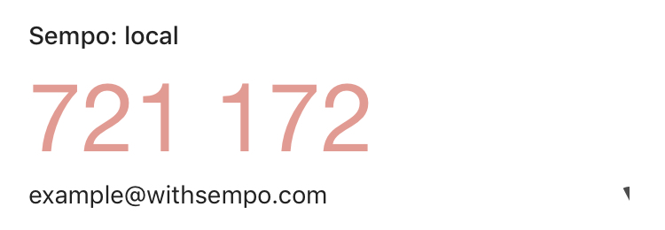

# Signing up for Dashboard access

## Signing up as a subadmin or view only

If you are going to join the Sempo Dashboard as a [subadmin or enroller](../dashboard-overview/access-tiers.md), to accept an invitation, simply:

1. Click on the link in the invitation email you will have received. 
2.  Select a password with at least 8 characters and a mix of characters and numbers.

You will now have access to the Dashboard!


If you have not received your invitation email, please ask your organisation's admin to[ resend an invite](../accessing-the-dashboard-1.md), and check your spam inbox.


## Signing up as a superadmin or admin

If you will be joining the Sempo platform as a superadmin or admin \(see[ Access Tiers](../dashboard-overview/access-tiers.md)\), to sign up you will need:

* A two-factor authentication app installed on your Mobile Phone, for security reasons
* An email invite to join as a superadmin or admin 

### Installing the Two Factor Authentication App

If you are an admin or superadmin on Sempo, you will need to install a two-factor authentication \(2FA\) app and use a code generated from this app for increased security.


_**Two-factor authentication \(often shortened to 2FA\)** provides a way of 'double-checking' that you’re really the person you’re claiming to be when you log into your online accounts, such as banking, email or social media._


To install an authenticator app:

1. On your mobile phone, search for Google Authenticator \(or your preferred authentication app\) from the [Google Play store](https://play.google.com/store/apps/details?id=com.google.android.apps.authenticator2&hl=en_AU) or [Apple](https://apps.apple.com/au/app/google-authenticator/id388497605) store. 
2. Select Install, and sign up for an account using your email. 
3. Make sure that the time on your phone is set correctly \(to automatically be the time in your timezone\).   __ 

### Signing up for Access to the Dashboard

After you have installed a 2FA such as Google Authenticator, please:

1. Check that your existing organisation or Sempo \(help@withsempo.com\) has [invited](../accessing-the-dashboard-1.md) you to join as a superadmin or admin. You will have received an invitation link in your email inbox.
2. Click on the invitation link to sign up with your email address. You will need to enter a password with a mix of characters and numbers. 
3. A QR code will then appear on your computer screen with the sign "Two-Step Authentication Required".

4. Open up your Authentication App and press the “+” button and “Scan Barcode”. Then using your phone's camera **scan** the QR barcode that appears on your computer. 

You will now have added Sempo to your Authenticator app!

5.  Click "Next" on the Sempo Dashboard website until you see the message "Two-Step Authentication Required", and space for a 6 digit code. Enter the 6-digit code that appears on your phone's Authentication app into the Sempo website.   
  
_\(Hint: If you are using a private computer, click "Remember Computer"\)._

**Once you've entered your code, hit 'VERIFY' and you're done!**

Please note: Two-factor authentication codes continuously update, so make sure the one you enter is still valid.  Two-factor authentication codes will turn red in Google Authenticate when they are about to expire. Once a code has expired, it will be replaced with a new, valid code.


Two-factor authentication requires the time on your phone to be set correctly, so you're having trouble authenticating, make sure your phone has the correct time set. If you're still having trouble adding two-factor authentication or getting access to the Sempo Dashboard, please contact [help@withsempo.com](mailto:help@withsempo.com)



DO NOT delete the Google Authenticator mobile app or codes without first changing devices or disabling Two Factor Authentication.




