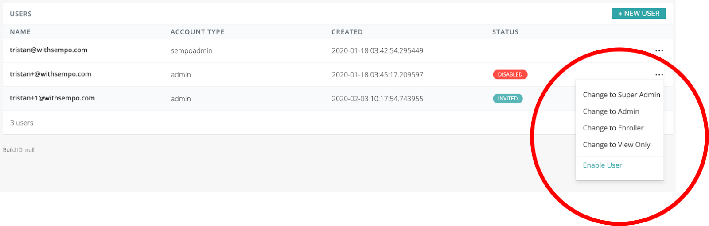

# Admin access tiers

The platform offers four levels of access:

* **Superadmin:** Access to all functions, including setting transfer limits, and inviting others onto the Platform. This level is typically reserved for the Program Lead, and requires two-factor authentication for security purposes.
* **Admin:** Access to all functions except for changing transfer limits or inviting superadmins. This means they can enrol program participants, edit their details, approve and transfer value \(up to transfer limits\), and invite other admins or below. This level works well for Program Managers.
* **Subadmin \(also known as Enroller\):** Access to the functions of enrolling program participants \(e.g. beneficiaries or vendors\), editing their details, and inviting others to join as subadmins. Cannot make transfers. This works well for third-party enrollers.
* **View Only:** Access only to viewing high-level data on the program performance, but no personal information on beneficiaries. \(This works well for donors, finance managers, monitoring and evaluation parties etc\).

### How to change a user's tier

To manage an existing user's administrative permissions, simply navigate to:

1. The Settings page

2. Scroll down, to see the particular admin user \(that you would like to change.\)

3. Next to their name, click on the 3 dot action icon  of the admin user. A submenu will appear enabling you to enable/disable an admin user or change permissions.

