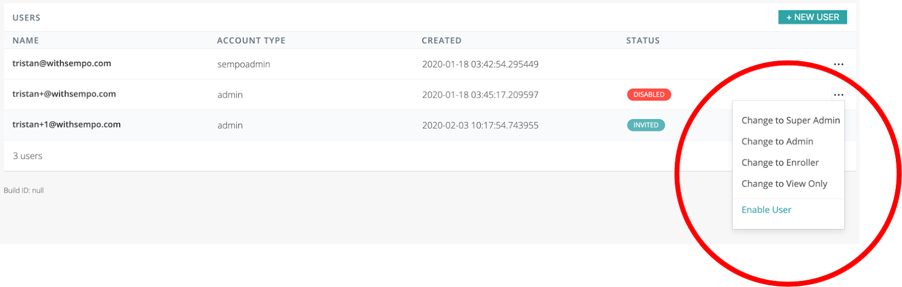

# Access Tiers

The platform offers four levels of access:

* **Superadmin:**  All functions, deployment owner \(i,e. head of operations\)
* **Admin:** All edit, approve and transfer functions \(e.g. program manager\)
* **Enroller:** Recipient only enrollment ability, no ability to make disbursements. \(e.g. community leader\)
* **View Only:** Can only view high- level data on how your program is performing. No PII exposed.  \(e.g. a donor, M&E, finance manager\) 

To manage an existing admin users permissions, simply click on the 3 dot action icon  of the admin user you would like to update. A submenu will appear enabling you to enable/disable an admin user or change permissions.

