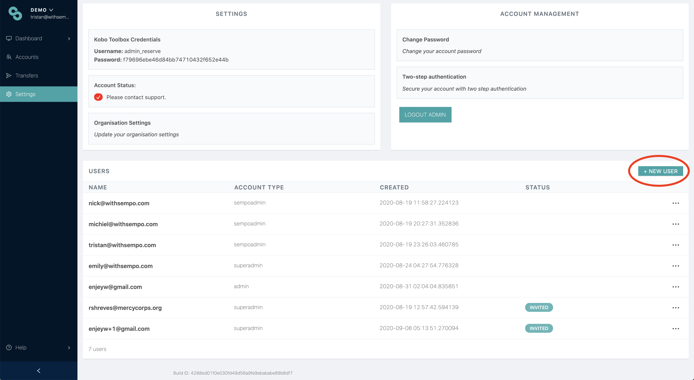
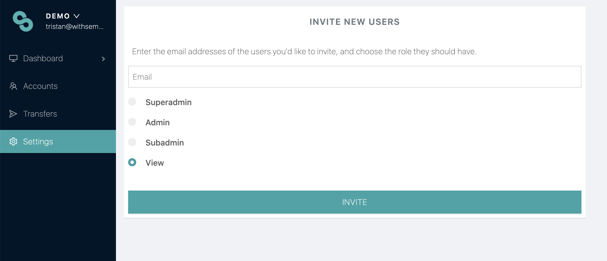

# Inviting new admins


**To get access to the dashboard ask your platform admin to invite you**. If you need help, please reach out to [help@withsempo.com](mailto:help@withsempo.com) or your Sempo account manager.


The Superadmin will assign access by following the below process:

1. Go to Settings
2. Select ‘+ New User’
3. Enter the New Users email address and choose their tier
4. If a user doesn't get an email, try resending it

Similar to the admin user list action, to manage an email invite, simply click on the 3 dot action icon  of the invite you would like to resend or delete.

