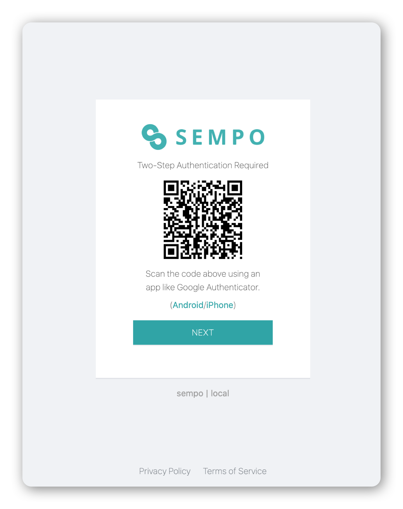

# Signing up as an admin to the Dashboard


This is the guide for **admin users** of the Sempo platform.


1. Ask your superadmin to invite you to your organisation's Sempo instance
2. Click on the invite link in your email inbox
3. Sign up and set a secure password

## Two Factor Authentication 


_**Two-factor authentication \(often shortened to 2FA\)** provides a way of 'double-checking' that you’re really the person you’re claiming to be when you log into your online accounts, such as banking, email or social media._


If you are an admin or superadmin you need to set a two-factor authentication \(2FA\) code for increased security.

After setting your password for the first time, you will be prompted to scan a QR code using an Authenticator Application. We recommend Google Authenticator.

> Google Authenticator is a software-based authenticator by Google that implements two-step verification services using the Time-based One-time Password Algorithm.





Click the 'add' button inside your Authenticate mobile app, and scan the QR code.

Once you have added Sempo to Google Authenticator, you can enter the 2FA code after clicking 'NEXT'.

2FA codes continuously update, so make sure the one you enter is still valid. 2FA codes will turn red in Google Authenticate when they are about to expire. Once a code has expired, it will be replaced with a new, valid code.

2FA requires the time on your phone to be set correctly, so you're having trouble authenticating, make sure your phone has the correct time set. If you're still having trouble adding 2FA, please contact [help@withsempo.com](mailto:help@withsempo.com)


DO NOT delete the Google Authenticator mobile app or codes without first changing devices or disabling Two Factor Authentication.




