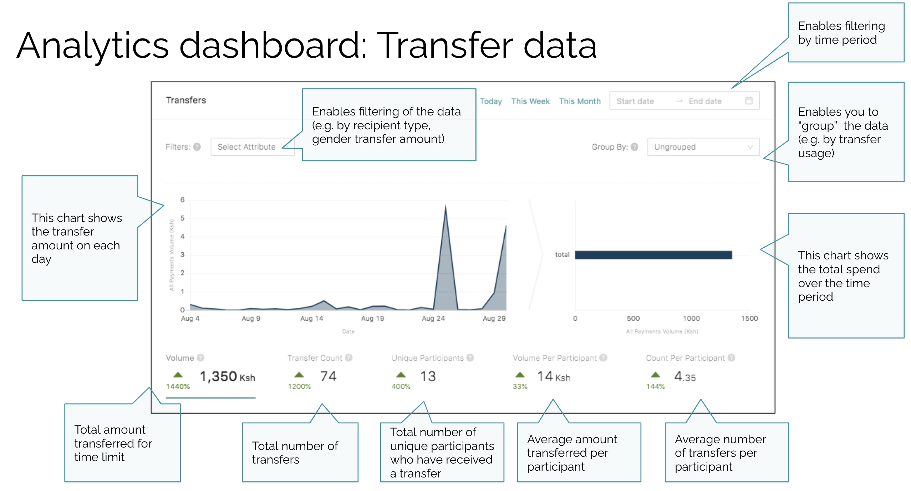

# Dashboard overview

This is the main dashboard display, used for program registration, disbursement and monitoring.

### **Key features of the dashboard**

* Transaction/ Disbursement Volume over time
* Total figures distributed and spent
* Recipients enrolled
* Categories to break down spend 
* Live transaction feed
* Live Map of transactions

### Analytics Overview

On the analytics page of the dashboard, you'll be able to use tools to **filter data** \(such as a period of time, age, disability etc.\), **group data by attributes** \(such as location, transfer usage etc.\) and view **data options** \(such as Volume, Transfer Count, Unique Participants, Volume per Participant and Count Per Participant\).

This enables complex and powerful queries to gain new insights into how your programs are performing for monitoring and evaluation. 

> For example, you could generate a query that **displays transaction volume over the current month**, grouped by **transfer usage**. You could filter this data to only display participants who are between the **ages of 25-40**, **female, in the town of Port Villa.**



### **How to navigate the dashboard**



### Tiers: managing access





