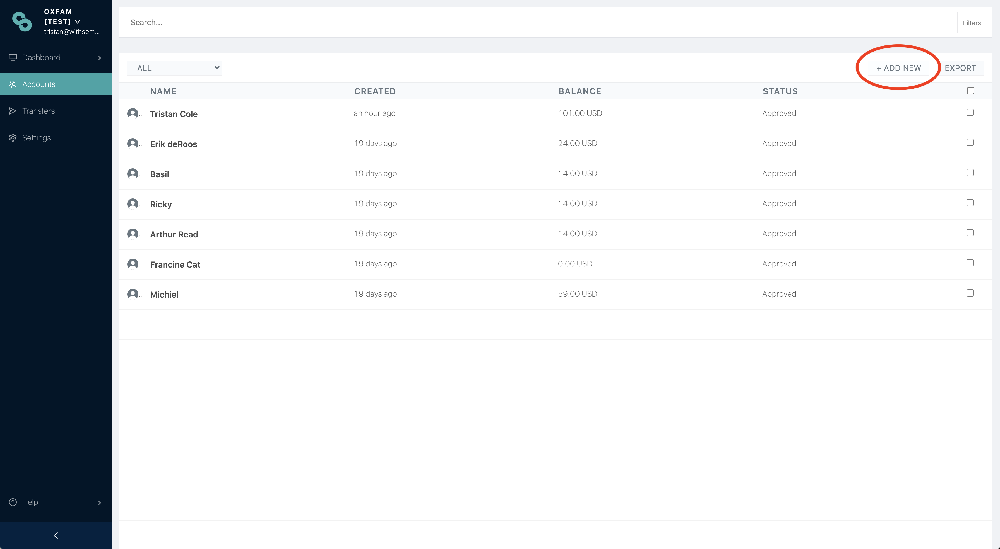

# How to register participants

There are four ways to register participants:

1. Via Sempo Dashboard
2. Via Kobo Toolbox
3. Via Spreadsheet Upload
4. Via Self Sign Up \(if enabled\)

## 1. Via Sempo Dashboard

**Step 1:** From the Sempo Dashboard, click on Accounts in the side-bar, and then “+ Add New” in the top right hand corner.

Alternatively, navigate to [https://app.withsempo.com/create](https://app.withsempo.com/create)


Note, your sub-domain might be different for your organisation


**Step 2:** Ensure that account type is set to “BENEFICIARY”  \(or other word set in settings\)

**Step 3:** Enter the user’s first name and last name. 

If recipients will be logging into the Android app, add their phone number.  Alternatively, if they will be using a transfer card, you can enter the serial number manually, or click on the QR icon to scan a card using your browser’s camera.

**Step 4:** If you wish to disburse funds immediately, enter an amount. Alternatively, leave the value as 0.


Note: The initial disbursement amount will be set to the default disbursement amount set in the organisation settings \([https://app.withsempo.com/settings/organisation](https://app.withsempo.com/settings/organisation)\)


**Step 5:** The confirmation screen will show a 4 digit PIN. If participants are using the Android App, tell them this pin, and they can use it along with their phone number to log into the app. Otherwise ignore the pin. This pin will also be sent via SMS to the participant.

The new recipients can now be viewed from the Accounts page!

## 2. Via Kobo Toolbox

Registration via an-in person interview

1. Collect vendor information -  company name, key contact name, phone number, bank details and location 
2. Agree to and sign Credit Payout Cycle Agreement and update on the Account Page
3. Upload of data on the Sempo platform via spreadsheet or KoboToolbox
4. If required, an android phone is to be provided to vendor for duration of pilot
5. Provide in-person training on use of app/ Vendor How-to- distribute brochure



## 3. Via Spreadsheet Upload

Disabled

## 4. Via Self Sign Up

If self sign up is enabled, the account will automatically be created. See the following guides:





\*\*\*\*

\*\*\*\*

