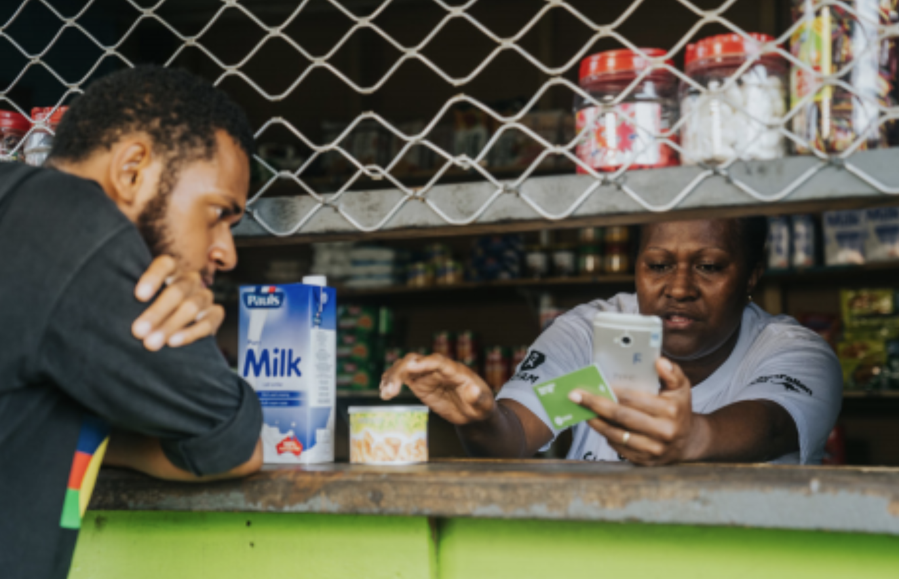
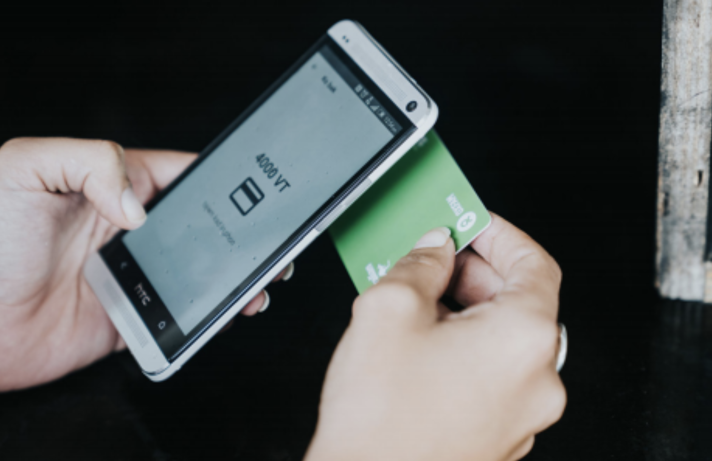

# Using Sempo's contactless cards as a beneficiary


**For NGOs**, get in contact with Sempo to print your **custom branded** cards [team@withsempo.com](mailto:team@withsempo.com)



**For vendors**, see our [guide on how to accept payments](../mobile-app/using-the-app-as-a-vendor.md#how-to-accept-payments).


### How to use Sempo's Tap-to-Pay cards?

1. Go Shopping! **Look for vendors** that support Sempo.
2. Once **you're ready to pay**, the **vendor will enter the amount and the category of your purchase** into the app on their phone.

3. To pay just **tap your card** anywhere on the vendor's phone. Hold it still for 5 seconds.

**4. Congratulations!** Vendors will show you payment confirmation and the remaining balance on your card.


You can [check your balance](../mobile-app/using-the-app-as-a-vendor.md#how-to-check-balance) with a **Community Focal Person** or **any vendor.**  



