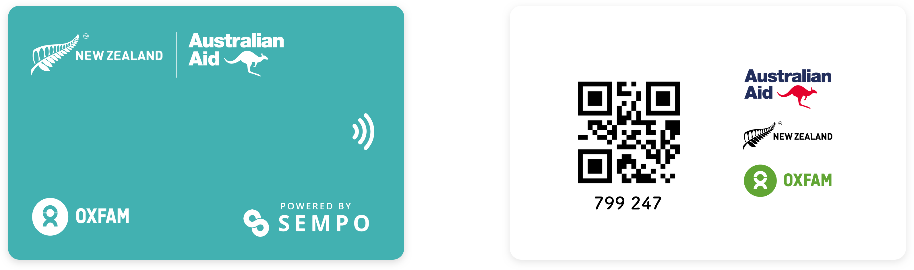
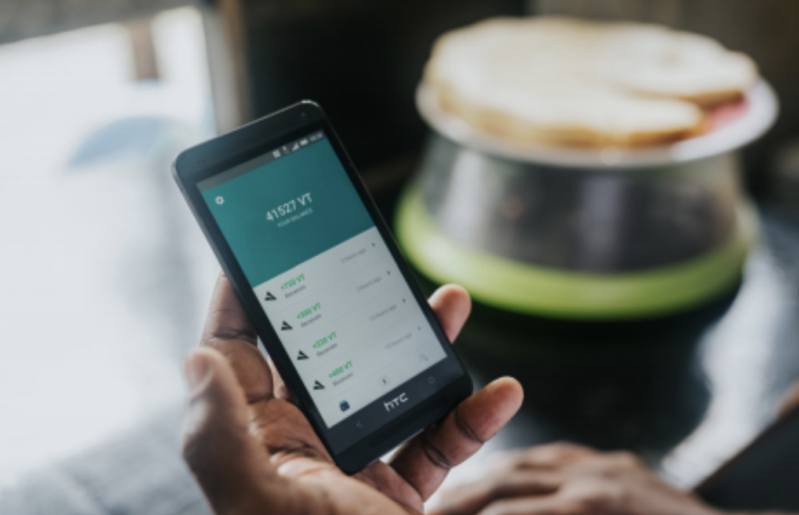
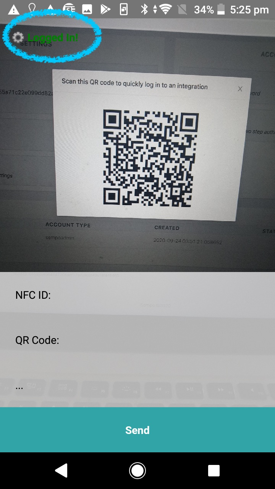

# Using Sempo's contactless cards


**For NGOs**, get in contact with Sempo to print your **custom branded** cards [team@withsempo.com](mailto:team@withsempo.com)



**For vendors**, see our [guide on how to accept payments](../mobile-app/using-the-app-as-a-vendor.md#how-to-accept-payments).


### How to use Sempo's Tap-to-Pay cards?

1. Go Shopping! **Look for vendors** that support Sempo.

2. Once **you're ready to pay**, the **vendor will enter the amount and the category of your purchase** into the app on their phone.

3. To pay just **tap your card** anywhere on the vendor's phone. Hold for 5 seconds.

4. **Congratulations!** Vendors will show you payment confirmation and the remaining balance on your card.


You can [check your balance](../mobile-app/using-the-app-as-a-vendor.md#how-to-check-balance) with a **Community Focal Person** or **any vendor.**  
  


## Adding Tap-To-Pay Cards to the Sempo Platform 

Before you can use a touch-to-pay card, you need to add it to the Sempo platform.

Sempo can do this for you before shipping you the cards, but sometimes it's quicker and easier to do it yourself, especially if you don't have many cards.

 To add cards, you'll need a phone with an NFC scanner in it - just like the ones vendors will use.  

### Logging into the Sync App

Sempo's Card Sync App is an easy way to add a card to the platform. It's actually hidden inside the regular Sempo Mobile App, but requires a special login process to use.

First, log into the Sempo Dashboard, and navigate to the Settings page. Then, click on the QR Code icon in the "Plugin/Integration Credentials" section. A QR code that can be used to login will appear:

Now, login to Sempo's Mobile App using any account. Then, navigate to settings, and press the "Sync" option near the bottom of the screen. A QR code scanner will appear. Point this at the QR code showing on the dashboard.
After a few seconds, the words "Logged In" should appear in the top left corner of the screen. You're now ready to start adding Cards!

### Adding a touch-to-pay card

First, point the QR Code Scanner of the Sync App at the QR Code on the back of a Sempo Touch-to-Pay card. The Card's Public Serial Number will appear on the screen.

Next, touch the card to the NFC scanner on your phone (normally at the back). Now the NFC ID will appear on the screen as well.

Once this is done, simply click "Send" to add the card, and your card will be added!

