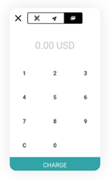
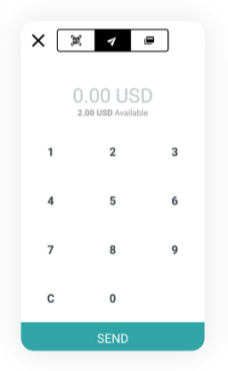

# Cómo usar la aplicación Sempo como proveedor

## ¿Cómo puedo abrir la aplicación? 

1. **Abrirla** haciendo clic en el icono de Sempo  
2. **Entra** al sistema introduciendo tu número de teléfono y tu código **PIN**. \(La primera vez que inicie sesión, su PIN serán los últimos cuatro dígitos de su número de teléfono. La próxima vez que abras la aplicación se te pedirá que introduzcas tu código de acceso. Elija un código que sea fácil de recordar y seguro. No se lo digas a nadie.\). Haga clic en Iniciar sesión para continuar.



## ¿Cómo acepto los pagos con la aplicación Sempo?



1. Busca y abre la aplicación **Sempo**  
2. Abajo en la parte inferior derecha de la aplicación de Sempo, toca para seleccionar **el modo de transacción**  
3. En la parte superior de la pantalla hay tres iconos. Toca el icono de la derecha con las tarjetas, para recibir un pago con tarjeta 
4. Introduzca el importe total que desea cobrar al cliente. Luego haga clic en **Cargar**.   
5. **Seleccione las categorías** de todos los productos/servicios que se compran. Si no está seguro, seleccione "Otros". Luego haga clic en "Siguiente".  **** 
6. En la siguiente pantalla, debajo del código QR, toque Toque para pagar la tarjeta. 
7. Pídele al beneficiario que sostenga su tarjeta en la parte trasera de tu teléfono por 5 segundos. _\(Nota: El lugar donde debe sostener su tarjeta dependerá del modelo de su teléfono\)._  
8. Una vez completada la transacción, aparecerá una pantalla de confirmación. 

En caso de no tener conexión a Internet, el saldo se actualizará una vez que se restablezca la conexión. Simplemente vaya a la pantalla de su cartera  y tocar el campo de equilibrio y bajarlo para refrescarlo.


Para el teléfono Kogan Agora XI, tienes que sostener la tarjeta contra el centro de la parte trasera del teléfono.




## ¿Cómo comprobar el saldo de un cliente?

1. Open the Sempo App and select **Transaction Mode** 
2. There are three icons at the top of the screen. Touch the **left icon with the QR scanner symbol**.  **** 
3. **Hold the customer's** card to the back of the phone.   
4. **The balance will appear on your phone. Show the balance of the card** to the customer.

## How to cash out from another vendor?

_Do you need cash sooner than the agreed pay cycle?_

1. **Go to another vendor** and check if they can pay the cash out in the amount you asked for.
2. Open the Sempo app and click the **transact mode**  
3. Use a slider on top of the screen. **Slide it to the middle.**  
4. **Enter the amount** you wish to cash out and click **send.**   
5. **Show the QR code** to the vendor. The code contains the details of the transaction.  

## How to **cash out another vendor?**

1. Open the Sempo app and click the **transact mode** 
2. Use a slider on top of the screen. **Slide it to the left.**  ****Position the code in a way that fits in the square on the screen.
3. **Payout cash** in the amount you received in your digital wallet.  
4. **Register in your books.** Remember to register the pay out in your own books.  

## How to give a refund

If a vendor needs to refund a customer \(eg. if they accidentally overcharged\), the vendor needs to:

1. Notify the organisation managing the cash transfer program of the name of the customer, and the exact amount owed. 
2. The organisation and/or Sempo can perform a reclamation of the amount from the vendor, and then disburse the owed amount to the customer

## Exporting vendor data

1. Go to the settings page and click "Export Data"
2. Enter an email address and click the button. You will receive an email with a spreadsheet link \(expires in 24 hours\). This contains all transfers on the account with data. Specifically: Transfer Amount, Created, Resolved Date, Transfer Type, Transfer Use, Transfer Status.

## How to update the App

**1. When you have access to the internet, click on the "Play Store App"**

**2. Search for 'Sempo' at the top of Play Store**

**3. When you see the Sempo App appear, click on Update. If you are prompted for a username and password, please use any google account details.**

Note: If "Update" is not available but you see an "Open" button, that means you have access to the latest version of the app!

