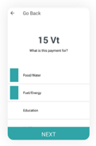

# Cómo usar la aplicación Sempo como proveedor

## ¿Cómo puedo abrir la aplicación? 

1. **Abrirla** haciendo clic en el icono de Sempo  
2. **Entra** al sistema introduciendo tu número de teléfono y tu código **PIN**. \(La primera vez que inicie sesión, su PIN serán los últimos cuatro dígitos de su número de teléfono. La próxima vez que abras la aplicación se te pedirá que introduzcas tu código de acceso. Elija un código que sea fácil de recordar y seguro. No se lo digas a nadie.\). Haga clic en Iniciar sesión para continuar.

## ¿Cómo acepto los pagos con la aplicación Sempo?



1. Busca y abre la aplicación **Sempo**  
2. Abajo en la parte inferior derecha de la aplicación de Sempo, toca para seleccionar **el modo de transacción**  
3. En la parte superior de la pantalla hay tres iconos. Toca el icono de la derecha con las tarjetas, para recibir un pago con tarjeta 
4. Introduzca el importe total que desea cobrar al cliente. Luego haga clic en **Cargar**.   
5. **Seleccione las categorías** de todos los productos/servicios que se compran. Si no está seguro, seleccione "Otros". Luego haga clic en "Siguiente".  **** 
6. En la siguiente pantalla, debajo del código QR, toque Toque para pagar la tarjeta. 
7. Pídele al beneficiario que sostenga su tarjeta en la parte trasera de tu teléfono por 5 segundos. _\(Nota: El lugar donde debe sostener su tarjeta dependerá del modelo de su teléfono\)._  
8. Una vez completada la transacción, aparecerá una pantalla de confirmación. 

En caso de no tener conexión a Internet, el saldo se actualizará una vez que se restablezca la conexión. Simplemente vaya a la pantalla de su cartera  y tocar el campo de equilibrio y bajarlo para refrescarlo.


Para el teléfono Kogan Agora XI, tienes que sostener la tarjeta contra el centro de la parte trasera del teléfono.


## ¿Cómo comprobar el saldo de un cliente?

1. Abre la aplicación de Sempo y selecciona **el modo de transacción** 
2.  Hay tres iconos en la parte superior de la pantalla. Toque el icono izquierdo con el símbolo del escáner QR.   **** 
3. Sostenga la tarjeta del cliente contra la parte posterior del teléfono.

\*\*\*\*

**4.** El saldo aparecerá en su teléfono. Muestre el saldo de la tarjeta al cliente.

## Cómo dar un reembolso

 Si necesita reembolsar a un cliente, por favor contacte con la Organización. Dígale a la organización el nombre del cliente, y la cantidad exacta que se debe. La organización puede revertir la transferencia.

## Exportar datos de proveedores 

1. Vaya a la página de configuración y haga clic en "Exportar datos" 
2. Introduce una dirección de correo electrónico y haz clic en el botón. Recibirás un correo electrónico con un enlace a una hoja de cálculo \(caduca en 24 horas\). Este contiene todas las transferencias de la cuenta con datos. Específicamente: Monto de la transferencia, Creado, Fecha resuelta, Tipo de transferencia, Uso de la transferencia, Estado de la transferencia.

## Cómo actualizar la aplicación

**1.Cuando tengas acceso a Internet, haz clic en "Play Store App"**

**2. Busca "Sempo" en la parte superior del Play Store**

**3. Cuando veas aparecer la aplicación de Sempo, haz clic en Actualizar. Si se te pide un nombre de usuario y una contraseña, utiliza los datos de cualquier cuenta de Google.**

Nota: Si "Actualizar" no está disponible pero ves un botón "Abrir", significa que tienes acceso a la última versión de la aplicación.

